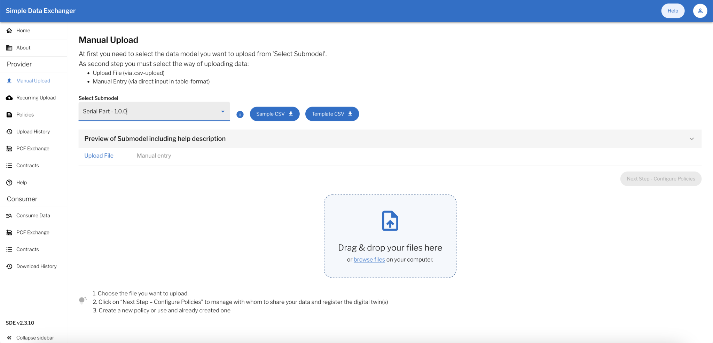
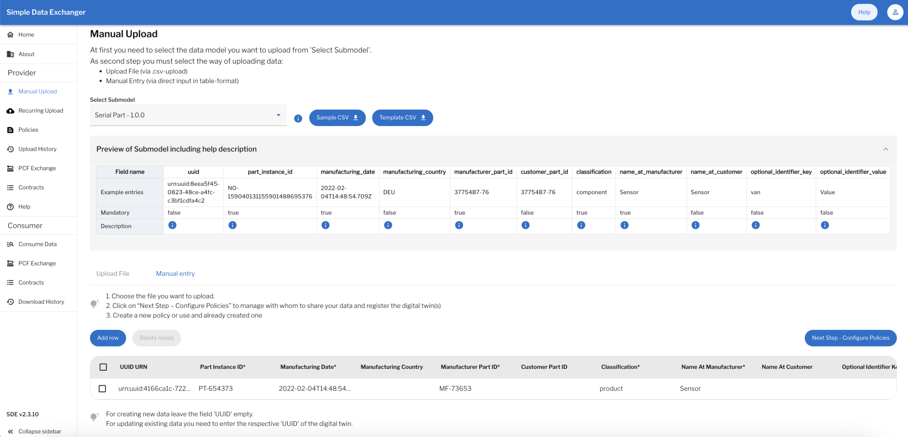
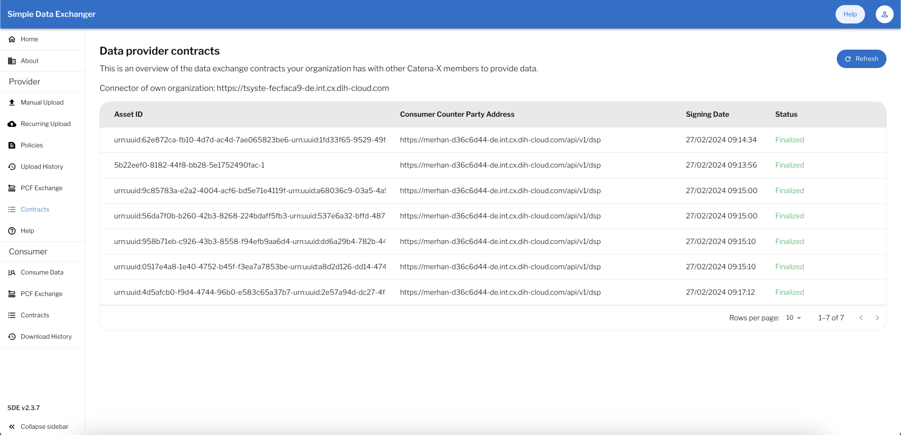
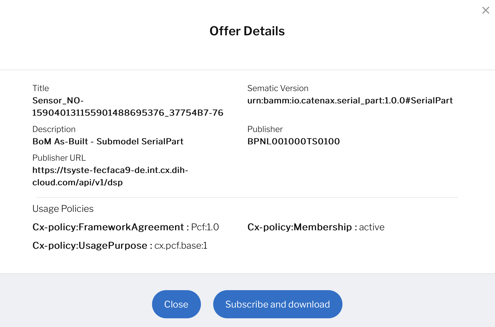

# Simple Data Exchanger - User Guide

## NOTICE

This work is licensed under the [Apache-2.0](https://www.apache.org/licenses/LICENSE-2.0).

- SPDX-License-Identifier: Apache-2.0
- SPDX-FileCopyrightText: 2021,2024 T-Systems International GmbH
- SPDX-FileCopyrightText: 2022,2024 Contributors to the Eclipse Foundation
- Source URL: https://github.com/eclipse-tractusx/managed-simple-data-exchanger-frontend

## Table of contents

- [Getting started](#getting-started)
  - [Accessing the app](#accessing-the-app)
    - [Login](#login)
    - [Logout](#logout)
  - [Navigation](#navigation)
    - [Header](#header)
    - [Main navigation](#left-side-menu)
- [Features](#features)
  - [Home](#home)
  - [About](#about)
  - [Provider](#provider)
    - [Manual Upload](#manual-upload)
      - [Upload File](#upload-file)
      - [Manual Entry](#manual-entry)
    - [Recurring Upload](#recurring-upload)
    - [Policies](#policies)
    - [Upload history](#upload-history)
    - [PCF Exchange](#pcf-exchange)
    - [Contracts](#provider-contracts)
    - [Help](#help)
  - [Consumer](#consumer)
    - [Consume Data](#consume-data)
    - [PCF Exchange](#pcf-exchange)
    - [Contracts](#consumer-contracts)
    - [Downlaod History](#download-history)
    

# Getting started

## **Accessing the app**

**SDE** can be accessed via the internet. The recommended browser is Google Chrome. You need to request an account to access it.

### **Login**

 

1. Open **S**imple **D**ata **E**xchanger application via the **URL** (recommended browser Google Chrome).
2. Select the organization from the list or search the organization by typing name in input textbox and select the organization from the search results to login to the Simple Data Exchanger application. After selecting the organization from the list, it will redirect to the CatenaX keycloak login page.
3. On Keycloak login page of the selected organization, enter login details i.e. Username or email and Password. Click on Sign In button to login to the Simple Data Exchanger application.

### **Logout**

&nbsp;&nbsp;

1. On the header, click on the user avatar (top right).
2. On the menu click on "Logout".
3. You have signed-out of Simple Data Exchanger application and will be redirected back to the CatenaX signin page.

[-- end of 'getting started' section --]: #

# Navigation

SDE navigation is based on a header and a left-side menu.

## **Header**

1. On the left side on the header, there is the Simple Data Exchanger header text.
2. On the right side of the header, there is a help link. When clicked, it will redirect the user to simple data exchanger user guide. And there is avatar of the logged-in user. When clicked, there are few information about the logged in user, Logout link and Language switching options will be visible.

## **Left-side menu**

On the left side menu, it is possible to navigate the Simple Data Exchanger application by choosing each the following options / features:

- Home
- About

**Provider**

- Manual Upload
- Recurring Upload
- Policies
- Upload History
- PCF Exchange
- Contracts
- Help

**Consumer**

- Consume Data
- PCF Exchange
- Contracts
- Download History

[-- end of 'navigation' section --]: #

# Features

# **Home**

After successful login, user will be redirected to this page by default in the Simple Data Exchanger application. This page contains the overview of the application and use cases selection.

Submodels in the Manual Upload page will be filtered out based on the usecase selection by user.

# **About**

In this page you can find the source links of License, Notice, Base Repository and Git-hub Commit ID of the latest version.

# **Provider**

## Manual Upload

In this page, list of available submodels will be fetched dynamically and we can select any submodel to generate the table or json of that selected submodel based on the schema provided by backend API.

This dynamic UI implementation allows the flexibillity to support and manage multiple submodels in single SDE application and also eliminates the need of hard coded react components for the individual submodels.

There are 2 data providing options in SDE i.e. CSV Upload and Manual entry.
The top level Select submodel dropdown will be common for all of 2 tabs i.e. Upload File, Manual entry. Based on the selected submodel user can download the respective CSV sample and template.

Preview of submodel including help description is provided as collapsible view.

This Create Data page combines all the Data provider options like:-

- ### Upload File

You can upload CSV files of various supported Submodels.

At the moment, Simple Data Exchanger supports data proving options for below list of submodels,

- Serial Part - 1.0.0
- Serial Part - 3.0.0
- Single Level Bom AsBuilt - 1.0.0
- Single Level Bom AsBuilt - 3.0.0
- Batch - 2.0.0
- Batch - 3.0.0
- Part AsPlanned - 1.0.0
- Part Type Information - 1.0.0
- Single Level Bom AsPlanned - 1.0.1
- Single Level Bom AsPlanned - 3.0.0
- Part Site Information AsPlanned - 1.0.0
- Single Level Usage AsBuilt - 1.0.1
- Single Level Usage AsBuilt - 3.0.0
- Product Carbon Footprint (pcf) - 6.0.0

You can click on the button "Choose a file" and select the proper CSV file present in your file system or you can just drag and drop your file in the drop area under upload file component.

After successful file upload of the supported file format i.e. CSV, the button "Next Step - Configure Policies" will be enabled and after clicking on the same, Policy selection dialog will be shown where we need to configure Access and Usage policy.

User can create new or choose existing policy.

Use can configure access and usage polices accordingly. 

Once configuring both the policies, we need to click on "SUBMIT" button and wait for upload to finish.
This is the process of creating new data offer through SDE application by uploading CSV file.

- ### Manual Entry

You can add and submit multiple data offers via Manual entry option for particular submodel by clicking on "Add Row" button to bulk upload the multiple data offers in one go. Once you enter details in all of the required fields for a particular row, you need to select which offers we need to upload by ticking the checkboxes for the respective rows and then we need to click on "Next Step - Configure Policies" button to configure Access and Usage policies and then you need to click on Submit button from policy dialog to upload the data. You can upload the data for multiple submodels by selecting the respective submodel from the top level Select submodel dropdown.
We also can delete multiple rows by selecting which rows we want to delete and then click on Delete Row(s) button.

Then you need to configure Access and Usage policies by clicking on "Next Step - Configure Policies" button and after successful configuration, click on Submit button from policy dialog to upload bulk data offers at once.

You can add other sub-model  similarly.

## Recurring Upload

You can utilize the SDE for automated CSV file uploads. You must use the Object Storage/SFTP interface to transfer your CSV files to cloud storage. The SDE will then upload the CSV files according to the parameters.

- Schedules

- Storage Media

- Email Configuration

- Settings

User can change the above parameters accordingly.

## Policies

User can add and edit the policies in this page by clicking add policy button. So that policies for manual upload process is possible and  for recurring upload process. The policy name should be included in your upload file for recurring upload, and it must be unique.

After clicking on the add policy button, Add Policy  dialog will be shown where we need to configure Policy Name, Access and Usage policies.

Once configuring both the policies, we need to click on "SUBMIT" button to finish and create policy. This is the process of creating new policy through SDE application. User can use this policy in manual upload or while uploading the file in Object Storage/SFTP storage.

## Upload history

In this menu you can see the list of uploaded data offers.

The table has the following columns:

- Process Id
- CSV Type
- Created(number of Successfully Created items)
- Updated(number of Successfully Updated items)
- Deleted(number of Successfully Deleted items)
- Failed(number of failed items)
- Start Date
- Status

User can delete and download any uploaded data offer by clicking on the respective action icon present at the end of each row.
The delete icon will only be visible if the Number of Deleted Items count is 0.
After the successful data offer deletion, new row will be generated which shows the new process id and the reference id of the deleted data offer.
Uploaded submodel details can also be downloaded from here as CSV. Only for the deleted entry download option won't be visible.
We can fetch the updated data offers by manually clicking on Refresh button present at top right section of the Upload History page.

User can see the detailed error logs during the upload data by clicking "View errors" link.

## PCF Exchange

This page contain pcf exchange requests requiring approval.

## Provider Contracts

This page contains an overview of the data exchange contracts your organization has with other Catena-X members to provide data. 

The table includes below columns:

- Asset ID (ID of the Asset)
- Consumer Counter Party Address (Counter party address of the contract agreement)
- Signing Date (Signing date of the contract agreement)
- Status (FINALIZED or TERMINATED or ERROR or DECLINED)

## Help

This dynamic help page provides the submodel informations of selected use case in the home page. If no use case selected, it will show all available submodels. User can see the the order of the fields and details of each field by hovering the info icon in each row. User can download the sample csv and csv template for any submodels as well from this page. User can use quick link to navigate on any sub model. 

# **Consumer**

## Consume Data

After clicking on the "Consume Data" link in the sidebar navigation menu, user will be redirected to this Consumer view page. On this page, we need to select search type as Company Name or Business Partner Number to enable the search. User can use Manufacturer Part Id and even select sub-model for particular search.
Result will shown in the table as:-

- Title
- Publisher
- Asset ID 
- Sematic Version
- Description

Also we can view and subscribe individual data offer by clicking on the respective row to open the offer details popup.
The offer details dialog will populate all the basic metadata of the selected offer and Usage policy details.
You can subscribe the data offer by clicking on "Subscribe and download" button and accepting the terms.
Zip file will be downloaded with respected data offer sub-model csv file with actual data which was used to create the data offer.

User can also subscribe to multiple data offers at a time by ticking or checking the checkbox in front of the data offers and clicking on the button "Subscribe and download" present at top right section of the data offers table.
Please note that, user can only subscribe to multiple data offers if the offers have exact similar usage policies configured.
After clicking on Subscribe and download button and agreeing to the terms and conditions, the contract agreements establishment process will start for all of the selected data offers for the subscription.
Zip file will be downloaded with respected data offers sub-models csv file with actual data which was used to create the data offers.

User can also request PCF by clicking Request PCF button. User need to enter Product ID, Select search type - Company Name/Business Partner Number and Message for pcf  request.

## PCF Exchange

This page will show history of pcf exchange requests.

## Consumer Contracts

This page contains an overview of the data exchange contracts your organization has with other Catena-X members to receive & consume data from them.

The table includes below columns:

- Asset ID (ID of the Asset);
- Provider Counter Party Address (Counter party address of the contract agreement);
- Signing Date (Signing date of the contract agreement);
- Status (FINALIZED or TERMINATED or ERROR or DECLINED);

## Download History

This history overviews your company's downloaded data from the Catena-X ecosystem. All activities are listed here. You can download the data again from this history list.
User can view the status of download and view error under Status column.

[-- end of 'features' section --]: #
